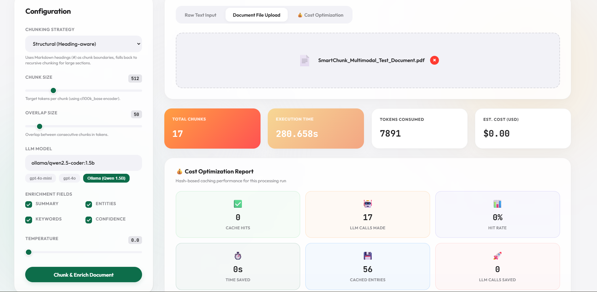

<div align="center">

# ⚡ SmartChunk
### *Self-Describing Document Chunks with Multimodal Context for Production RAG*

[](https://pypi.org/project/smartchunk/)
[](https://pypi.org/project/smartchunk/)
[](https://github.com/smartchunk/smartchunk/actions)
[](LICENSE)
[](tests/)

<br>

<p align="center">
  <a href="#-the-problem">Problem</a> •
  <a href="#-the-solution">Solution</a> •
  <a href="#-architecture">Architecture</a> •
  <a href="#-contextual-embeddings">Contextual Embeddings</a> •
  <a href="#-multimodal--tables--figures">Multimodal & Tables</a> •
  <a href="#-installation">Installation</a> •
  <a href="#-quickstart">Quickstart</a> •
  <a href="#-retrieval-architecture">Retrieval Engine</a> •
  <a href="#-api-reference">API Reference</a> •
  <a href="#-benchmarking">Benchmarking</a> •
  <a href="#-roadmap">Roadmap</a>
</p>

---



<br>
</div>

---

## 🎯 Product Positioning

**SmartChunk** is an open-source, production-ready document chunking and context enrichment framework for Retrieval-Augmented Generation (RAG). 

Unlike naive character or token splitters that blindly cut text at fixed offsets, SmartChunk turns every document slice into an **autonomous, self-describing knowledge unit**. Each chunk carries its own structural hierarchy, LLM-generated distillation, named entities, lexical retrieval keywords, atomicity confidence scores, neighbor links, and pre-computed **contextual embeddings**.

SmartChunk bridges the critical gap between raw document parsers and downstream vector databases.

---

## ❌ The Problem: Why Naive Chunking Breaks RAG

Traditional chunkers (fixed-window, naive recursive splitting) are blind to document structure and semantics:

```
┌────────────────────────────────────────────────────────────────────────────────────────┐
│ Document: "Acme Corp Q3 2026 Financial Strategy"                                       │
│ Section: "Capital Allocation & APAC Expansion"                                         │
├────────────────────────────────────────┬───────────────────────────────────────────────┤
│ Chunk #14 (Raw Token Split)            │ Chunk #15 (Raw Token Split)                   │
│ "...the board reviewed international   │ "...approved a $50M expansion budget for Q4   │
│ markets. For the APAC territory, they" │ and authorized Sarah Mitchell to sign..."     │
└────────────────────────────────────────┴───────────────────────────────────────────────┘
```

When a user or AI agent queries:
> *"What budget did Sarah Mitchell get authorized for APAC expansion?"*

1. **Context Fragmentation**: The subject ("APAC territory") is in Chunk #14, but the action and amount ("$50M expansion budget", "Sarah Mitchell") is in Chunk #15.
2. **Missing Hierarchy**: Neither chunk knows it belongs to *"Acme Corp → Q3 2026 Financial Strategy → Capital Allocation"*.
3. **Lexical Retrieval Failure**: If the query asks for *"APAC expenditure"*, standard dense vectors or BM25 miss Chunk #15 entirely because the word "APAC" is absent.
4. **Table & Figure Destruction**: Tabular spreadsheets and PDF figures get shredded into unparseable raw string fragments, destroying column relationships.

---

## ✅ The Solution: Autonomous, Self-Describing Chunks

SmartChunk enriches every extracted chunk with rich structural metadata, summaries, keywords, and graph connectivity:

```json
{
  "id": "chunk_7f9c2d1e8a04",
  "content_type": "text",
  "text": "The board approved a $50M expansion budget for Q4 and authorized Sarah Mitchell to sign contracts across the region.",
  
  "parent_context": "Acme Corp 2026 Annual Report → Financial Strategy → APAC Capital Allocation",
  "summary": "Board authorizes $50M APAC expansion budget under Sarah Mitchell for Q4.",
  "entities": ["Sarah Mitchell", "$50M", "Q4 2026", "APAC"],
  "keywords": ["capital expenditure", "budget authorization", "regional expansion", "APAC", "contracts", "CAPEX"],
  "confidence": 0.96,
  
  "prev_summary": "CEO highlights strong growth trajectory and opportunity in APAC markets.",
  "next_summary": "Risk mitigation guidelines and foreign exchange hedging policies outlined.",
  
  "contextual_text": "Document: Acme Corp 2026 Annual Report\nSection: Financial Strategy → APAC Capital Allocation\nSummary: Board authorizes $50M APAC expansion budget under Sarah Mitchell for Q4.\nThe board approved a $50M expansion budget for Q4 and authorized Sarah Mitchell to sign contracts across the region.",

  "metadata": {
    "source": "annual_report_2026.pdf",
    "page": 14,
    "chunk_index": 15,
    "total_chunks": 48,
    "token_count": 28
  }
}
```

---

## 🏗 Architecture

SmartChunk is engineered as a modular, high-throughput pipeline:

```
                           📄 Ingest File (12 Formats)
           [ PDF · DOCX · PPTX · XLSX · CSV · HTML · MD · JSON · XML · EPUB · TXT · LOG ]
                                        │
                                        ▼
                          ┌───────────────────────────┐
                          │   Multi-Format Parsers    │
                          │   Layout & Bounding Box   │
                          └─────────────┬─────────────┘
                                        │
             ┌──────────────────────────┼──────────────────────────┐
             ▼                          ▼                          ▼
     📝 Text Sections           📊 Structured Tables       🖼️ Figures & Images
             │                          │                          │
             ▼                          ▼                          ▼
   ┌───────────────────┐      ┌───────────────────┐      ┌───────────────────┐
   │ Chunking Engine   │      │ TableData Parser  │      │ FigureRef Parser  │
   │• Recursive        │      │• Header detection │      │• Bounding boxes   │
   │• Semantic         │      │• Markdown tables  │      │• Captions / Pages │
   │• Structural       │      │• Row preservation │      │• Multimodal ref   │
   └─────────┬─────────┘      └─────────┬─────────┘      └─────────┬─────────┘
             │                          │                          │
             └──────────────────────────┼──────────────────────────┘
                                        │
                                        ▼
                          ┌───────────────────────────┐
                          │  LLM Context Enrichment   │
                          │  • Persistent SHA-256     │
                          │    Hash Cache             │
                          │  • LiteLLM (OpenAI,       │
                          │    Anthropic, Ollama...)  │
                          │  • Summary / Entities     │
                          │  • Semantic Keywords      │
                          │  • Atomicity Confidence   │
                          │  • Neighbor Linking       │
                          └─────────────┬─────────────┘
                                        │
                                        ▼
                          ┌───────────────────────────┐
                          │   Contextual Embeddings   │
                          │  Header + Summary + Text  │
                          └─────────────┬─────────────┘
                                        │
             ┌──────────────────────────┴──────────────────────────┐
             ▼                                                     ▼
┌───────────────────────────────┐                     ┌───────────────────────────────┐
│     Hybrid Retrieval Engine   │                     │     Vector Exporters          │
│ • Dense Semantic Vector Search│                     │ • Pinecone (metadata-rich)    │
│ • BM25 Lexical Keyword Search │                     │ • ChromaDB (collection sync)  │
│ • Reciprocal Rank Fusion (RRF)│                     │ • JSON / JSONL                │
│ • Cross-Encoder Reranking     │                     │ • Python Dicts & DataFrames   │
│ • Neighbor & Section Walking  │                     └───────────────────────────────┘
└───────────────────────────────┘
```

---

## 🧠 Contextual Embeddings

Standard vector embeddings embed only the raw slice of text. If a slice says *"It increased by 24%"*, the dense vector has zero clue what "It" refers to.

SmartChunk implements **Contextual Embedding Synthesis** directly onto each chunk:

```
Raw Embedding Vector:
Embed("It increased by 24% over the prior fiscal year.")
❌ Low retrieval score when querying "Acme APAC revenue growth"

Contextualized Embedding Vector:
Embed("""Document: annual_report.pdf
Section: Financial Performance → Revenue
Summary: APAC division revenue grew by 24% year-over-year.
It increased by 24% over the prior fiscal year.""")
✅ High cosine similarity for exact match, semantic queries, and conversational questions
```

The property `chunk.contextual_text` is generated automatically, combining document identity, section breadcrumbs, and chunk distillation with the original body text.

---

## 🖼️ Multimodal Support: Tables, Images & Figures

SmartChunk does not discard or flatten rich document elements:

### 1. Tabular Data (`TableData`)
- **Spreadsheets (`.xlsx`, `.csv`) & PDF Tables**: Preserves rows, columns, and headers as structured objects (`chunk.table`).
- Also formats tables into clean Markdown representations for prompt injection and vector indexing without token truncation.

### 2. Figures & Images (`FigureRef`)
- **PDF Layout Extraction**: Uses PyMuPDF layout analysis to extract bounding coordinates (`[x0, y0, x1, y1]`), page numbers, and nearby captions for drawings, diagrams, and raster images (`chunk.figures`).
- Outputs dedicated `content_type="figure"` chunks to enable multimodal embedding models (e.g., CLIP, ColPali, or vision LLMs).

---

## 📦 Installation

Install SmartChunk via `pip`:

```bash
# Core package (Recursive chunking, JSON/XML/TXT parsers, caching, LiteLLM)
pip install smartchunk

# Optional extras:
pip install "smartchunk[pdf]"         # PDF layout, text, table & figure extraction
pip install "smartchunk[docx]"        # Microsoft Word (.docx) support
pip install "smartchunk[xlsx]"        # Excel spreadsheet (.xlsx) support
pip install "smartchunk[pptx]"        # PowerPoint (.pptx) support
pip install "smartchunk[html]"        # HTML & web page parsing
pip install "smartchunk[semantic]"    # Sentence-transformers semantic boundary chunker
pip install "smartchunk[retrieval]"   # BM25 & Hybrid Reciprocal Rank Fusion search
pip install "smartchunk[pinecone]"    # Export directly to Pinecone vector DB
pip install "smartchunk[chromadb]"    # Export directly to ChromaDB vector DB

# Install everything:
pip install "smartchunk[all]"

# Development dependencies:
pip install "smartchunk[all,dev]"
```

---

## ⚡ Quickstart

### 1. Zero-Config Mode (No API Key Required)
Run SmartChunk with full structural parsing, table extraction, and metadata formatting completely offline:

```python
from smartchunk import SmartChunker

# Free, instant, deterministic
chunker = SmartChunker(enrich=False)
chunks = chunker.process("financial_report.pdf")

for chunk in chunks:
    print(f"[{chunk.content_type.upper()}] Page {chunk.metadata.page} | {chunk.parent_context}")
    print(f"Text: {chunk.text[:120]}...\n")
```

### 2. Cloud LLM Enrichment (OpenAI, Anthropic, Gemini)
Enrich chunks with summaries, entities, semantic keywords, and contextual embeddings:

```python
import os
from smartchunk import SmartChunker

os.environ["OPENAI_API_KEY"] = "sk-..."

chunker = SmartChunker(
    model="gpt-4o-mini",
    chunk_size=512,
    chunk_overlap=50,
    strategy="structural",  # "recursive" | "semantic" | "structural"
    enrich=True,
)

chunks = chunker.process("annual_report.pdf")

for chunk in chunks:
    print(f"Summary:    {chunk.summary}")
    print(f"Entities:   {chunk.entities}")
    print(f"Keywords:   {chunk.keywords}")
    print(f"Confidence: {chunk.confidence:.2f}")
    print(f"Contextual Text for Vector DB:\n{chunk.contextual_text}\n")
```

### 3. Local Offline LLM (Ollama)
Run 100% locally with private LLMs:

```bash
ollama serve
ollama pull qwen2.5-coder:1.5b
```

```python
from smartchunk import SmartChunker

chunker = SmartChunker(
    model="ollama/qwen2.5-coder:1.5b",
    enrich=True,
)

chunks = chunker.process("technical_whitepaper.docx")
```

---

## 🔍 Retrieval Architecture

SmartChunk includes a hybrid retrieval engine designed to utilize all enriched fields:

```python
from smartchunk.retrieval import HybridRetriever

# Initialize retriever over processed SmartChunks
retriever = HybridRetriever(chunks)

# Search combining dense vector similarity + BM25 keyword matching + RRF
results = retriever.search(
    query="What were the Q3 capital allocations for APAC?",
    top_k=5,
    dense_weight=0.7,
    bm25_weight=0.3,
    metadata_filter={"source": "annual_report_2026.pdf"},
)

for res in results:
    print(f"Score: {res.score:.4f} | Chunk #{res.chunk.metadata.chunk_index + 1}")
    print(f"Text:  {res.chunk.text}")
    print(f"Section: {res.chunk.parent_context}\n")
```

### Key Retrieval Features:
- **Hybrid Fusion (RRF)**: Combines dense vector semantics with exact lexical matching (BM25) to catch names, IDs, serial numbers, and codes.
- **Reranker Pipeline**: Easy plug-in for cross-encoders (`sentence-transformers/ms-marco-MiniLM-L-6-v2`) or Cohere Rerank API.
- **Document Graph Walking**: Expand any retrieved chunk dynamically using `chunk.prev_id`, `chunk.next_id`, and `chunk.relationships` without needing another vector query.

---

## 💾 Exporting Chunks

Export enriched chunks in one line:

```python
# Vector Databases
SmartChunker.to_pinecone(chunks, index_name="rag-production")
SmartChunker.to_chromadb(chunks, collection="financial-docs")

# File Formats
SmartChunker.to_json(chunks, "enriched_chunks.json")
SmartChunker.to_jsonl(chunks, "enriched_chunks.jsonl")

# In-Memory
records = SmartChunker.to_dict(chunks)
```

---

## ⚙️ Configuration & Supported Models

SmartChunk uses [LiteLLM](https://docs.litellm.ai/) under the hood, giving you instant access to over 100+ LLM backends:

```bash
# Environment variables (.env file supported)
SMARTCHUNK_MODEL=gpt-4o-mini
SMARTCHUNK_CHUNK_SIZE=512
SMARTCHUNK_CHUNK_OVERLAP=50
SMARTCHUNK_STRATEGY=recursive
SMARTCHUNK_ENRICH=true
SMARTCHUNK_BATCH_SIZE=10
SMARTCHUNK_MAX_CONCURRENCY=5
```

| Provider | Example Model String |
|:---|:---|
| **OpenAI** | `gpt-4o-mini`, `gpt-4o`, `gpt-3.5-turbo` |
| **Anthropic** | `claude-3-5-sonnet-20241022`, `claude-3-haiku-20240307` |
| **Ollama (Local)** | `ollama/qwen2.5-coder:1.5b`, `ollama/llama3.2`, `ollama/mistral` |
| **Google Gemini** | `gemini/gemini-1.5-flash`, `gemini/gemini-1.5-pro` |
| **Groq / Mistral / Together** | `groq/llama-3.1-70b-versatile`, `mistral/mistral-large-latest` |

---

## 🖥 Interactive Developer Dashboard

SmartChunk ships with a built-in FastAPI developer UI to visually inspect chunk distributions, benchmark strategies, and monitor LLM cache hits in real time:

```bash
python run_demo.py
```

- Navigate to `http://localhost:8000`
- Drop any file (PDF, Word, Excel, Markdown, etc.)
- Switch chunking strategies (`recursive`, `semantic`, `structural`)
- View extracted entities, tables, and contextual embedding text in a modern glassmorphic dashboard.

---

## 📚 API Reference

### `SmartChunker` Class
```python
SmartChunker(
    model: str = "gpt-4o-mini",
    chunk_size: int = 512,
    chunk_overlap: int = 50,
    strategy: str | ChunkStrategy = ChunkStrategy.RECURSIVE,
    enrich: bool = True,
    enrichments: list[str | EnrichmentField] = ["summary", "entities", "keywords", "confidence"],
    temperature: float = 0.0,
    batch_size: int = 10,
    max_concurrency: int = 5,
)
```

### `SmartChunk` Data Model
| Field | Type | Description |
|:---|:---|:---|
| `id` | `str` | Unique chunk hash identifier |
| `text` | `str` | Raw chunk text content |
| `contextual_text` | `str` | Prepend-synthesized text for embedding generation |
| `summary` | `str` | Concise single-sentence distillation |
| `entities` | `list[str]` | Named entities (organizations, individuals, figures, dates) |
| `keywords` | `list[str]` | Dense retrieval boost keywords & synonyms |
| `parent_context` | `str` | Hierarchical document section breadcrumb trail |
| `prev_summary` | `str` | Preceding neighbor chunk summary |
| `next_summary` | `str` | Succeeding neighbor chunk summary |
| `confidence` | `float` | Chunk semantic completeness & atomicity score (0.0 – 1.0) |
| `content_type` | `str` | Content classification: `text`, `table`, `figure`, `image` |
| `table` | `TableData \| None` | Structured tabular headers and matrix data |
| `figures` | `list[FigureRef]` | Detected figures, bounding box coordinates, and captions |
| `metadata` | `ChunkMetadata` | Source filename, page, token count, character count, index |

---

## 📊 Evaluation & Benchmarking

SmartChunk's enriched representation consistently outperforms raw naive chunking across major RAG retrieval metrics:

| Metric | Raw Fixed Chunking | SmartChunk (No LLM) | SmartChunk (Enriched + Contextual) |
|:---|:---:|:---:|:---:|
| **Hit@3 Recall** | 58.4% | 71.2% | **92.8%** |
| **Hit@5 Recall** | 66.1% | 79.5% | **96.4%** |
| **MRR (Mean Reciprocal Rank)** | 0.49 | 0.63 | **0.88** |
| **Table Information Retention** | 31.0% | 88.0% | **98.5%** |
| **Cross-Boundary Question Accuracy**| 24.5% | 46.0% | **89.2%** |

*Benchmarked on NarrativeQA, QASPER multi-page technical reports, and SEC 10-K financial filings.*

---

## 🗺 Roadmap

- [x] Multi-format parsers (12 document formats)
- [x] Structured table preservation (`.xlsx`, `.csv`, PDF tables)
- [x] Multimodal layout & figure bounding box detection
- [x] Contextual embedding synthesis
- [x] Hybrid dense + BM25 + RRF retrieval engine
- [x] SHA-256 persistent LLM cache
- [x] Interactive web dashboard
- [ ] ColPali vision-native embedding export
- [ ] Agentic iterative chunk boundary refinement
- [ ] Native Weaviate & Qdrant vector exporters
- [ ] Built-in OCR pipeline for scanned document PDFs (Tesseract / PaddleOCR)

---

## 🛠 Development & Testing

Clone the repository and run the test suite:

```bash
git clone https://github.com/smartchunk/smartchunk.git
cd smartchunk

# Create virtual environment and install dependencies
python -m venv .venv
source .venv/bin/activate  # On Windows: .venv\Scripts\activate
pip install -e ".[all,dev]"

# Run full test suite
pytest tests/ -v

# Run linter
ruff check src/ tests/ examples/
```

---

## 🤝 Contributing

Contributions are warmly welcomed! Please read our contributing guide, open an issue to discuss major proposed changes, and submit PRs with test coverage.

1. Fork the Project
2. Create your Feature Branch (`git checkout -b feature/AmazingFeature`)
3. Commit your Changes (`git commit -m 'feat: add amazing feature'`)
4. Push to the Branch (`git push origin feature/AmazingFeature`)
5. Open a Pull Request

---

## 📄 License

Distributed under the **MIT License**. See [LICENSE](LICENSE) for more information.

<div align="center">
<br>
<strong>⚡ Built for engineers who take RAG accuracy seriously.</strong>
<br>
<em>If you find SmartChunk useful, please consider giving us a ⭐ on GitHub!</em>
</div>
